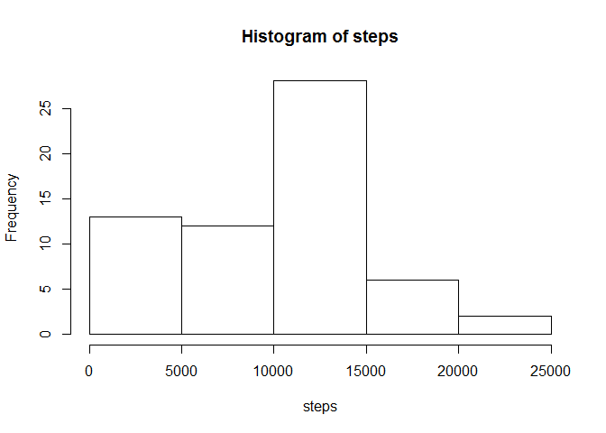
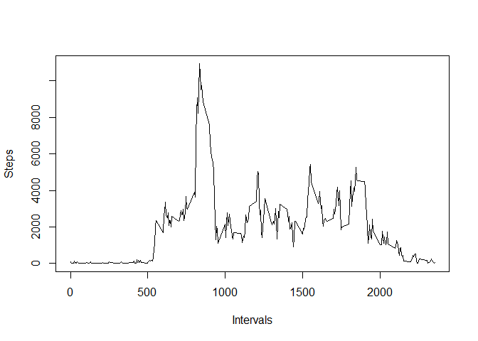
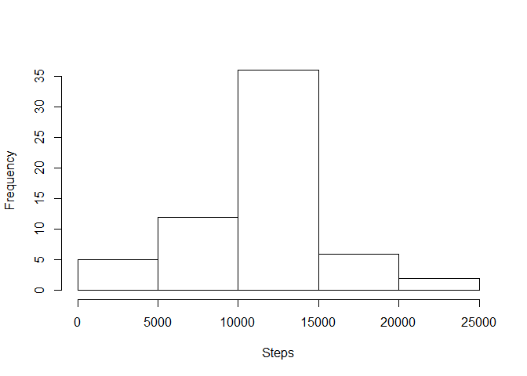

# Reproducible Research: Peer Assessment 1

##Loading and preprocessing the data

1. Load the data:

```r
data <- read.csv("activity.csv")
```

2. Process/transform the data:

```r
data$date <- as.Date( data$date , "%Y-%m-%d")
```


##What is mean total number of steps taken per day?

1. Make a histogram of the total number of steps taken each day:

```r
steps <- tapply( data$steps ,data$date , sum , na.rm = TRUE )
hist( steps )
```

 

2. Calculate and report the mean and median total number of steps taken per day:

```r
mean(steps)
```

```
## [1] 9354.23
```

```r
median(steps)
```

```
## [1] 10395
```


##What is the average daily activity pattern?

1. Make a time series plot of the 5-minute interval (x-axis) and the average number of steps taken, averaged across all days (y-axis):

```r
aux <- tapply( data$steps , data$interval , sum , na.rm = TRUE )
tinterval <- cbind( as.numeric(rownames(aux)) , as.numeric(aux))
colnames(tinterval) <- c("interval" , "steps")
tinterval <- as.data.frame(tinterval)
plot( x = tinterval$interval , y = tinterval$steps , type = "l" , xlab = "Intervals" , ylab = "Steps")
```

 

2. Which 5-minute interval, on average across all the days in the dataset, contains the maximum number of steps?

```r
tinterval[ which.max( tinterval$steps ) ,]$interval
```

```
## [1] 835
```


##Imputing missing values

1. Calculate and report the total number of missing values in the dataset

```r
sum( is.na( data$steps ))
```

```
## [1] 2304
```

2. Devise a strategy for filling in all of the missing values in the dataset.

My strategy is to fill in the NA values with the average of the 5-minute interval

3. Create a new dataset that is equal to the original dataset but with the missing data filled in

```r
aux <- tapply( data$steps , data$interval , mean , na.rm = TRUE )
interval.mean <- cbind( as.numeric(rownames(aux)) , as.numeric(aux))
colnames(interval.mean) <- c("interval" , "steps")
interval.mean <- as.data.frame(interval.mean)
newdata <- data
for( i in which(is.na(data$steps))){
  newdata[i,]$steps <- interval.mean[interval.mean$interval == newdata[i,]$interval,]$steps
}
```

4. Make a histogram of the total number of steps taken each day and Calculate and report the mean and median total number of steps taken per day

```r
nsteps <- tapply( newdata$steps , newdata$date , sum )
hist(nsteps , main = "" , xlab = "Steps")
```

 

```r
mean( nsteps)
```

```
## [1] 10766.19
```

```r
median( nsteps )
```

```
## [1] 10766.19
```


##Are there differences in activity patterns between weekdays and weekends?

1. Create a new factor variable in the dataset with two levels - "weekday" and "weekend" indicating whether a given date is a weekday or weekend day

```r
factor.day <- ifelse( as.POSIXlt(newdata$date)$wday %in% c(6,0) , "weekend" , "weekday")
newdata <- cbind( newdata , as.factor(factor.day))
colnames(newdata)[4] <- "day.of.week"
```

2. Make a panel plot containing a time series plot of the 5-minute interval (x-axis) and the average number of steps taken, averaged across all weekday days or weekend days (y-axis)

```r
newmean <- aggregate(steps ~ interval + day.of.week, newdata, mean)
library(lattice)
xyplot( steps ~ interval | day.of.week , data = newmean , type = "l" , aspect = 1/2)
```

 
